# PRISM

**Player Replay Intelligence and Strategic Modeling**
Specially for LoL

A vision-based behavioural analytics desktop application for League of Legends
players. PRISM watches gameplay **videos** and produces an explainable
behavioural intelligence report - playstyle, rotations, map presence,
aggression, risk, objectives, pressure stability, consistency, archetypes and
actionable improvement findings.

> **Core research question:** *Can a player's strategic identity and
> behavioural tendencies be extracted solely from gameplay recordings?*

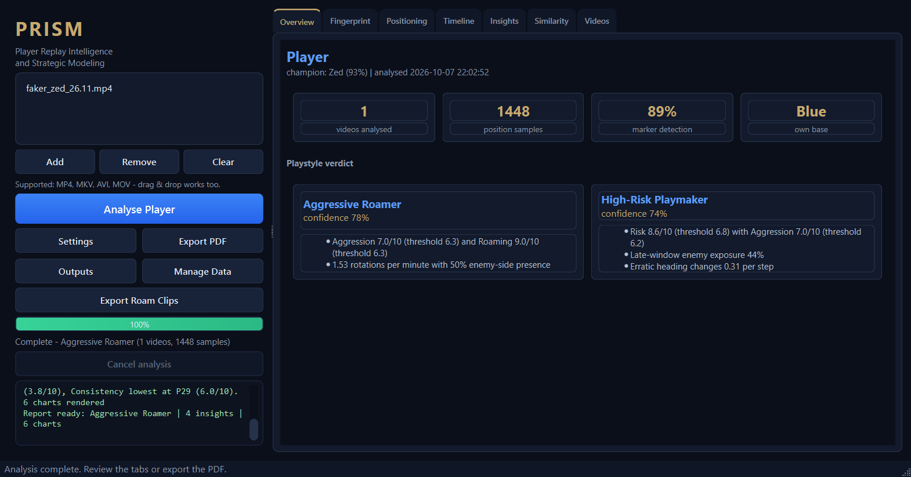

---

## What PRISM is (and is not)

| PRISM **is** | PRISM is **not** |
| --- | --- |
| A player intelligence platform | An AI coach |
| Explainable, confidence-scored insight | A statistics dashboard |
| Video-only behavioural analysis | A replay-file parser |
| Useful for self-review, coaching, scouting | An opponent scouting service |

## What makes PRISM different

Most replay tools parse the same official files and reformat the same
numbers. PRISM's distinctive capabilities come from *watching the game the
way a spectator would* - every one of them is extracted from video pixels,
with no telemetry of any kind:

| Distinctive capability | What it means |
| --- | --- |
| **Vision-only death inference** | Deaths are counted from the minimap marker vanishing away from base and reappearing at your fountain, corroborated by scoreboard kill deltas - no death feed, no API (`analytics/deaths.py`). |
| **Vision-adjusted risk** | "Pushing without vision": forward time with no recent ward bloom within 0.10 map units in the previous 120 s, scored directly into the fingerprint's Risk axis (`analytics/awareness.py`). |
| **Reaction-to-kill forensics** | How fast you change pace or heading after a kill appears on the scoreboard - a median response latency in seconds per video. |
| **Ward bloom tracking** | Stationary vision blooms in river/jungle/pit corridors are *detected from pixels* and feed the Vision axis - not read from a ward log. |
| **Offline champion identity** | 64-bit perceptual hash of the HUD portrait against prefetched Data Dragon icons - no account, no API call. |
| **Local peer benchmarking** | Your fingerprint ranked as percentiles against other players' stored profiles; the comparison set never leaves your disk. |
| **Explainable evidence** | Every axis, archetype, insight and event ships with the numbers and thresholds that produced it. |
| **Hard offline guarantee** | Tests run with networking blocked; nothing downloads unless you opt in with `PRISM_ALLOW_DOWNLOAD=1`. |

## Constraints honoured by the design

- **Video only.** No Riot API, no match telemetry, no replay/JSON/CSV input,
  no manual annotation.
- **100% free & offline.** No accounts, no logins, no fees, ever - no paid
  APIs, no cloud inference, no subscriptions, no telemetry. Everything runs
  locally after installation (OpenCV, EasyOCR, scikit-learn, Matplotlib,
  ReportLab, PySide6).
- **Full-match analysis (Early / Mid / Late / End).** The whole game is
  segmented into LoL phases: laning, trading, roaming, vision, objective
  play, teamfights and the end game.
- **Native desktop GUI** built with **PySide6** (no Tkinter/Streamlit/Flask).
- **Windows 10/11**, Python **3.12**, package manager **uv**, 16-32 GB RAM,
  dedicated GPU optional (CPU inference is the default).

## Features

- **Multi-format input** - MP4, MKV, AVI, MOV with validation and graceful
  rejection of corrupted files.
- **Automatic minimap localisation** (either screen corner, fixed ROI override
  available) with a *map-likeness* heuristic.
- **Player-marker tracking** using a background-motion model + appearance gate +
  prediction prior, with confidence per sample and gap interpolation.
- **Geometric region mapping** - Base, Top/Mid/Bot Lane, River, Blue/Red
  Jungle, Dragon Area, Herald Area.
- **Optional OCR** (EasyOCR, local) for the in-game match clock and the
  team-kill scoreboard; low-confidence reads are rejected, video time is used
  instead, and kill events are reconstructed from score deltas.
- **Champion identity** - the HUD portrait is matched offline (64-bit pHash
  against prefetched Data Dragon icons) with a confidence claim gate.
- **Ward/vision tracking** - stationary vision blooms in river/jungle/pit
  corridors become ward events feeding the Vision axis.
- **Vision/event micro-metrics** - inferred deaths from marker dropouts,
  unwarded forward time (vision-adjusted risk) and reaction latency after
  scoreboard kills.
- **Behavioural analytics** - aggression, roaming (timings, destinations,
  routes), objectives, pressure stability, consistency, similarity.
- **Benchmark percentiles** - each fingerprint axis ranked against `>= 3`
  stored profiles of other players (mid-rank percentile, same label excluded).
- **Fingerprint engine** - seven axes scored 0-10 with confidence and evidence
  strings.
- **Explainable archetypes** - every label ships with the numbers that
  triggered it.
- **Improvement insights** - finding + confidence + concrete suggestion +
  evidence.
- **Tactical timeline** of the whole match, with every window tagged with
  its game phase (Early / Mid / Late / End).
- **Visualisations** - fingerprint radar, region
  distribution, transition matrix, timeline, consistency, similarity.
- **PDF export** (ReportLab) and JSON export.
- **Roam clip export** - short MP4 clips around every detected roam,
  re-encoded with OpenCV (fully offline).
- **Storage manager** (`Manage Data`) - inspect what PRISM stored on disk
  (profiles, last report, charts, PDFs, clips, log, settings) and delete
  any of it; only those exact paths are ever touched.
- **Parallel multi-video analysis** - videos in a batch are analysed
  concurrently (bounded thread pool, results keep input order) with a
  benchmark-gated hardware-decode attempt on the first video.
- **QThread-driven GUI** - the window never freezes; live progress, stage and
  log updates.
- **Dark esports theme** - a Hextech-inspired navy/gold palette applied to
  the window, tables and every chart.
- **Rotating application log** at `logs/analysis.log`.

## Quick start

```powershell
# 1. install uv (once):  winget install astral-sh.uv
# 2. create the environment with Python 3.12
uv venv --python 3.12

# 3. install dependencies
uv pip install -r requirements.txt

# 4. (recommended, one-time, while online) pre-fetch EasyOCR models so the
#    app is fully offline afterwards; without them OCR stays off (by default
#    PRISM never downloads anything - set PRISM_ALLOW_DOWNLOAD=1 to opt in)
.venv\Scripts\python.exe -c "import easyocr; easyocr.Reader(['en'], gpu=False)"

# 5. launch
.venv\Scripts\python.exe main.py
```

Full details, verification steps and troubleshooting: **[docs/INSTALLATION.md](docs/INSTALLATION.md)**.

## Usage

1. Launch PRISM.
2. **Add** (or drag & drop) - select ~5 recordings of the same player.
3. Adjust **Settings** if needed (sampling rate, max game time, OCR, ROI).
4. Click **Analyse Player** and watch the progress/stage/log pane.
5. Review the tabs: Overview (identity, KPIs, verdict), Fingerprint (scores
   and what they mean), Positioning, Timeline, Insights, Similarity (vs
   stored profiles), Videos. Every fact is shown once, in its owner tab.
6. Click **Export PDF** to write `outputs/<player>_report.pdf`.
7. Click **Export Roam Clips** to write short MP4 clips of every detected
   roam to `outputs/clips/` (OpenCV re-encode, fully offline).

## Screenshots

All shots are from a real run - one 24-minute recording analysed locally on
CPU in about three minutes. Nothing here is mocked up.

**Live analysis** - progress, stage and log stream while the pipeline runs:

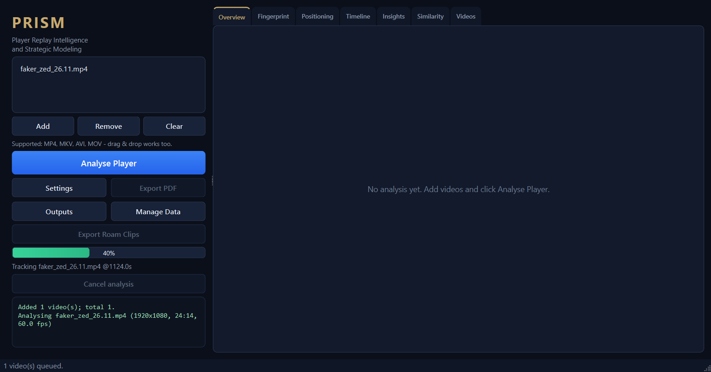

**Positioning** - where the player actually spent the match, straight from
minimap pixels:

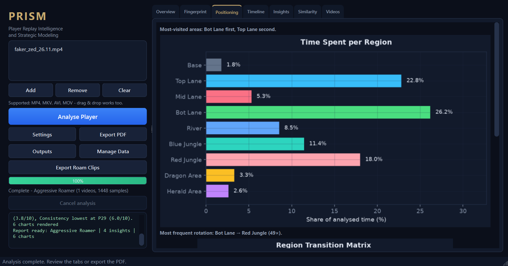

**Tactical timeline** - every window of the match tagged with its game phase
(Early / Mid / Late / End):

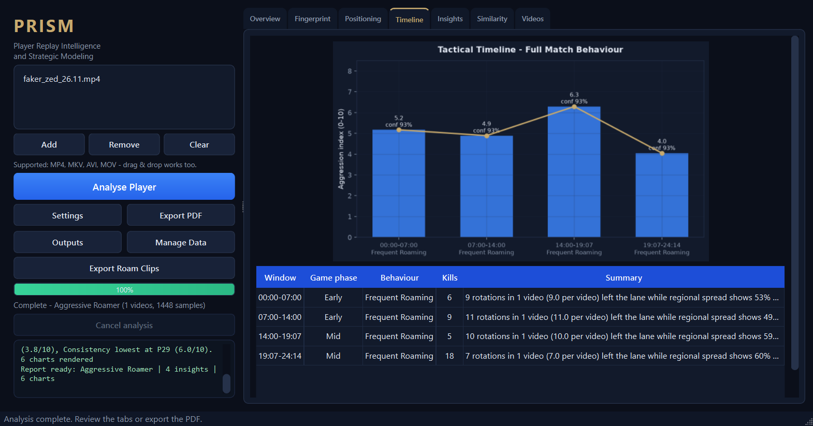

**Improvement insights** - confidence-scored findings with evidence and a
concrete suggestion each:

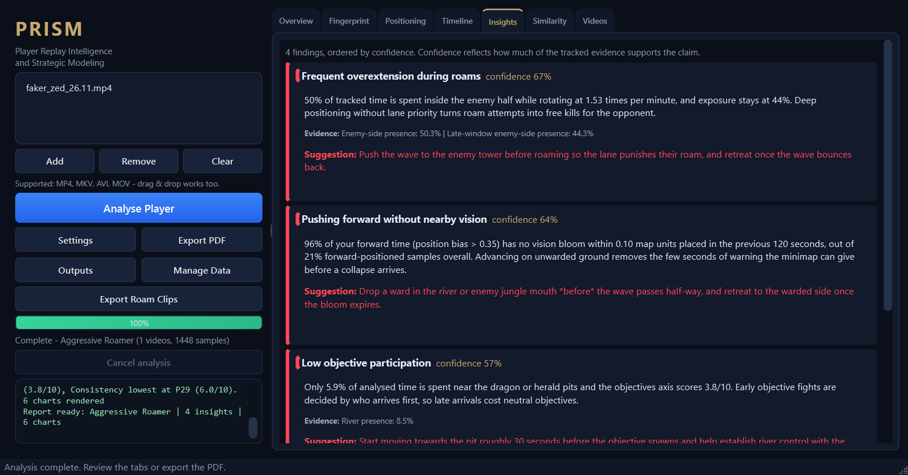

**Settings** - tracking, OCR, report and map-region tuning:

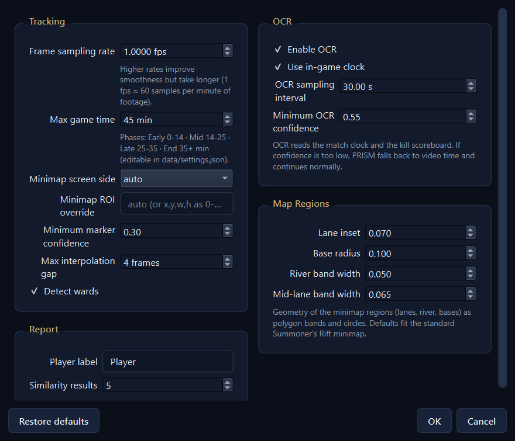

**Manage Data** - see and clear exactly what PRISM stored on disk:

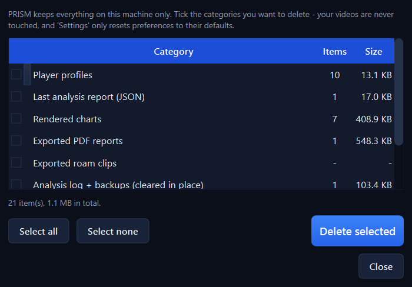

**Chart suite**, rendered in the dark Hextech theme used by both the app and
the PDF:

| | |
| --- | --- |
| **Behavioural fingerprint**<br>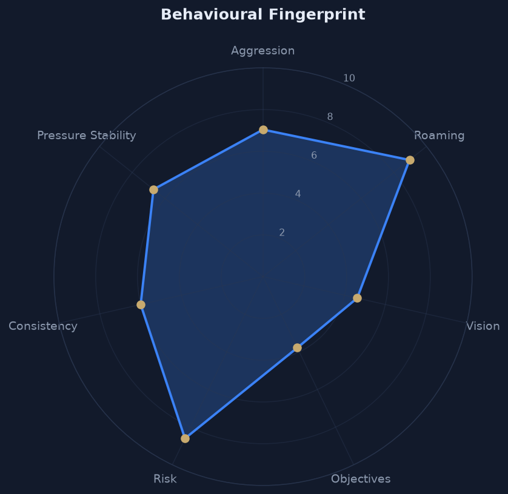 | **Tactical timeline**<br>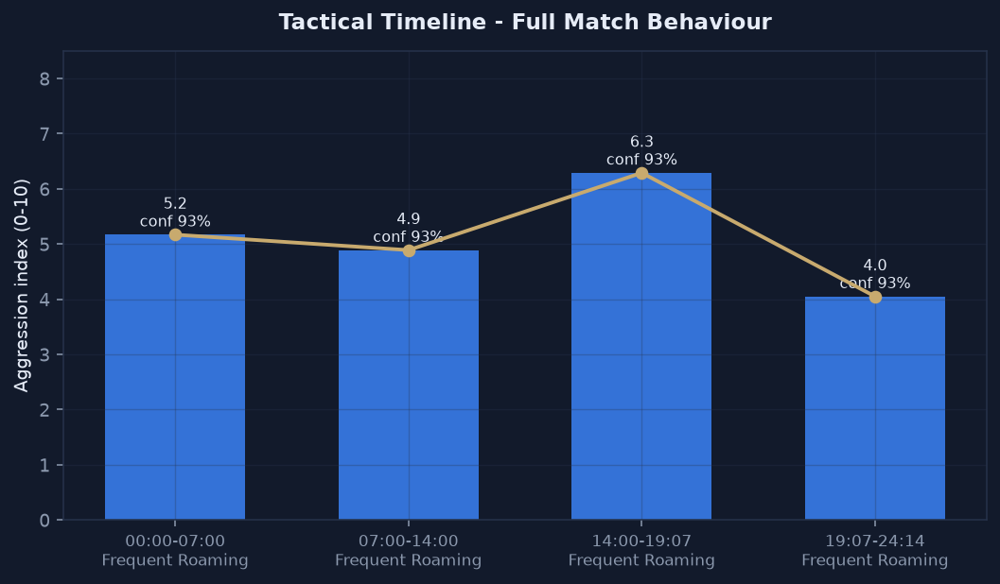 |
| **Region distribution**<br>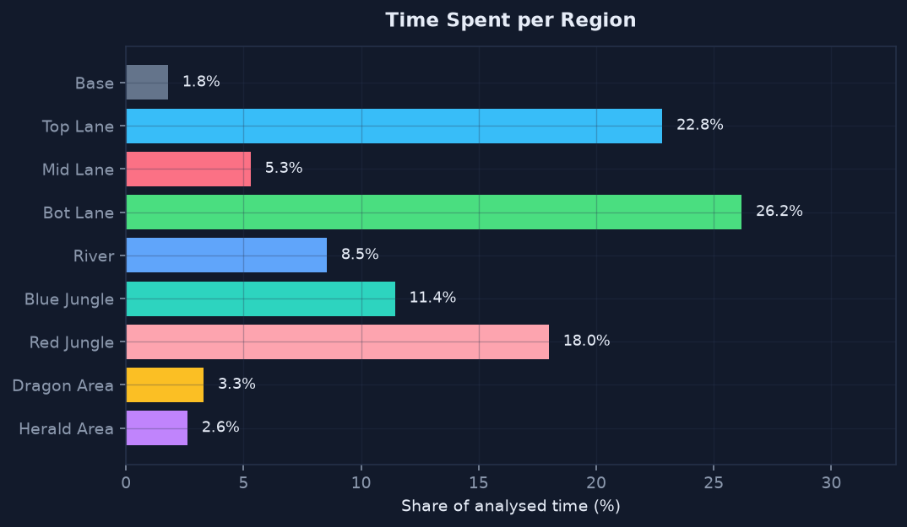 | **Region transitions**<br>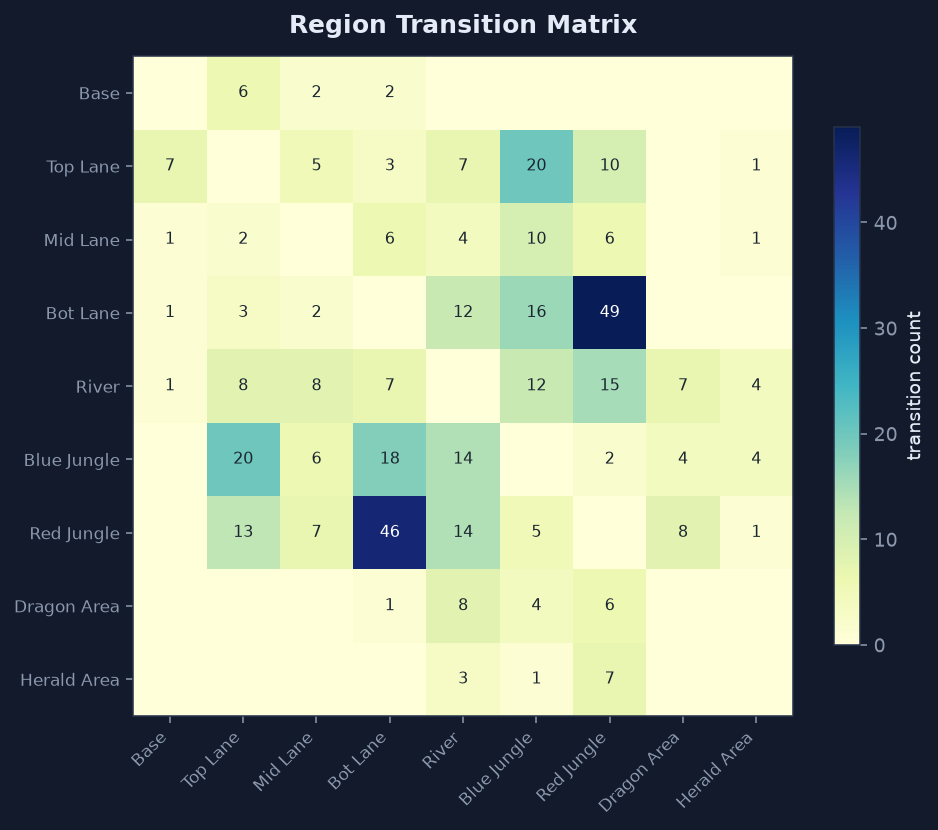 |

## Testing

```powershell
uv pip install pytest
.venv\Scripts\python.exe -m pytest tests -q
```

The suite generates a synthetic gameplay recording (scripted minimap marker
route) and validates the whole pipeline end to end: tracking -> regions ->
profile -> fingerprint -> analytics -> archetypes -> insights -> charts -> PDF.

## Project structure

```text
PRISM/
├── main.py                  # entry point
├── requirements.txt
├── pyproject.toml
├── gui/                     # PySide6 UI (main window, report tabs, settings, QThread workers)
├── core/                    # video loading, frame sampling, behaviour engine, profiler, fingerprint
├── vision/                  # ROI detection, minimap tracking, region mapping, OCR, confidence
├── analytics/               # aggression, roaming, objectives, pressure, consistency,
│                            # similarity, archetypes, insights, timeline
├── reports/                 # ReportLab PDF export
├── visualizations/          # Matplotlib chart suite
├── docs/                    # installation, architecture, technical docs + README screenshots
├── tests/                   # unit + end-to-end pipeline tests
├── data/                    # settings + stored profile snapshots (runtime)
├── outputs/                 # charts, JSON, PDF, roam clips (runtime)
└── logs/                    # analysis.log (runtime)
```

## Documentation

| Document | Contents |
| --- | --- |
| [docs/INSTALLATION.md](docs/INSTALLATION.md) | Environment setup, offline model prefetch, verification, troubleshooting |
| [docs/ARCHITECTURE.md](docs/ARCHITECTURE.md) | Layers, module responsibilities, data flow, threading, error handling |
| [docs/TECHNICAL.md](docs/TECHNICAL.md) | Algorithms, formulas, weights, thresholds, confidence model |

## Limitations (stated honestly)

- Position, region and rotation data come from the minimap; **vision, CS and
  KDA cannot be observed reliably**, so those axes are movement-based proxies
  with correspondingly lower confidence.
- OCR reads the match clock only; if confidence is too low the video timeline
  is used (the report says so).
- The minimap must not be rotated (the default League setting) and should be
  visible in-frame.
- Insights are statistical tendencies over the analysed match - not
  predictions of future matches.

## License

GPL-3.0-or-later - see [LICENSE](LICENSE).
